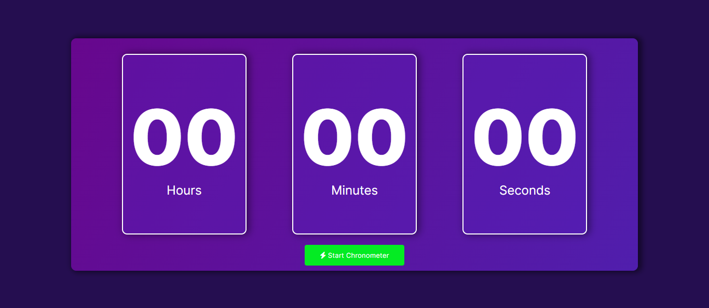

# Simple Chronometer

Link: <a href="https://adrwaan.github.io/simple-chronometer/">Simple Chronometer</a>

## Website page:

### In desktop:

## Technologies used in this project

## Author

* Developed by [@Adrwaan](https://github.com/Adrwaan)
